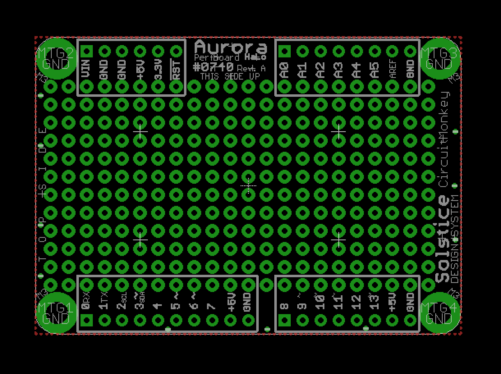

# solstice-core-starfire-pcb
Solstice Design System —  *Aurora* HaLo —  Eagle PCB

PCB files for the **Circuit Monkey** *Aurora* **Solstice** *HaLo*

Format is EagleCAD 9.x schematic and board layout

*Aurora* is a *Solstice* Hardware Locus (HaLo) module/shield.  The Aurora allows you to add a prototyping perf-board to the top of your Solstice Core module.

For more details, check out the product page at

  * https://www.circuitmonkey.com/product/0740   ( [404 - not found] this link is not yet active)

### Revision Notes
* Rev. 0 - Initial board design.  This revision was made for evaluation and only
one unit ever made.  Not shared in this repository.

* Rev. A - First revision meant for human consumption.

* Rev. B - Fixed Vin and GND pins swapped. First for-sale version.

#### Rev A. Issues:
  * Forgot to swap Vin and GND pins on HaLo connector.   Vin was dangerously close to GND mounting hole.  Was swapped on core StarFire board but we goofed in updating the Rev. A design for this board.  Solution for now is to pluck connector pins 1 and 2 out of HL4 passthrough connector prior to soldering.  Also, black sharpie the legend for those to pins.  Attempting to use these pins would short Vin to GND.

#### Rev B. Issues:
    * No known issues.

<<<<<<< HEAD
## Designed by Circuit Monkey in Las Vegas, Nevada, USA
Creative Commons Attribution, Share-Alike license, check license.txt for more information. Derivative of "Arduino Leonardo Reference design" (http://www.arduino.cc/en/Main/ArduinoBoardLeonardo)
=======
## Designed by Circuit Monkey
MIT License.
>>>>>>> 2a81e5fda4c45d648f762ef59328aa3b2a23b891

All text above must be included in any redistribution
